Challenge Solutions
================

Here are the solutions to the Challenges in the main tutorial
`Plotting Ocean Data With R`

## Initialize session

We first need to load the `tidyverse` and akima libraries:

``` r
library(tidyverse)
```

    ## -- Attaching packages ------------------------------------------------------------------------------------------------------------------------- tidyverse 1.3.0 --

    ## v ggplot2 3.3.2     v purrr   0.3.4
    ## v tibble  3.0.3     v dplyr   1.0.2
    ## v tidyr   1.1.2     v stringr 1.4.0
    ## v readr   1.3.1     v forcats 0.5.0

    ## -- Conflicts ---------------------------------------------------------------------------------------------------------------------------- tidyverse_conflicts() --
    ## x dplyr::filter() masks stats::filter()
    ## x dplyr::lag()    masks stats::lag()

``` r
library(akima)
```

    ## Warning: package 'akima' was built under R version 4.0.3

and the data:

``` r
fieldData <- read_csv('data/DamariscottaRiverData.csv')
```

    ## Parsed with column specification:
    ## cols(
    ##   date = col_double(),
    ##   station = col_double(),
    ##   depth_m = col_double(),
    ##   year = col_double(),
    ##   month = col_double(),
    ##   day = col_double(),
    ##   temperature_degC = col_double(),
    ##   salinity_psu = col_double(),
    ##   density_kg_m3 = col_double(),
    ##   PAR = col_double(),
    ##   fluorescence_mg_m3 = col_double(),
    ##   oxygenConc_umol_kg = col_double(),
    ##   oxygenSaturation_percent = col_double(),
    ##   latitude = col_double()
    ## )

## Challenge A

1.a. Create a scatter plot of ‘temperature\_degC’ by
‘fluorescence\_mg\_m3’ and color the points by ‘station’.

``` r
ggplot(data = fieldData, mapping = aes(x = temperature_degC, y = fluorescence_mg_m3)) + 
  geom_point(aes(color=station)) 
```

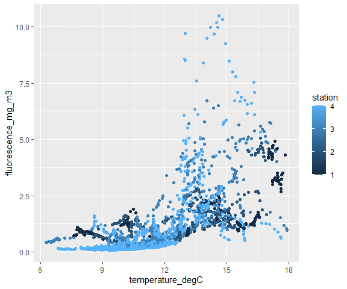<!-- -->

1.b. Do the same as 1.a. but convert the station values to factors.
What’s the difference between the two plots?

``` r
ggplot(data = fieldData, mapping = aes(x = temperature_degC, y = fluorescence_mg_m3)) + 
  geom_point(aes(color=factor(station)))  
```

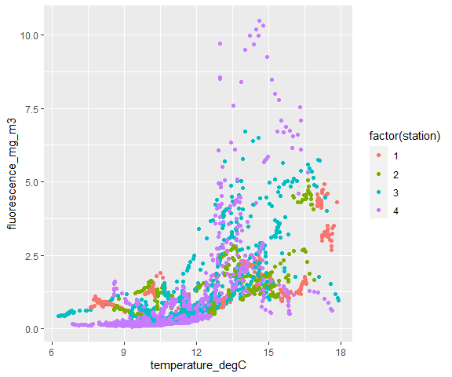<!-- -->

In the first plot, the colors are on a continuous colorscale. In the
second plot, the colors are discrete, separate colors. When the data was
read into R, the station values were read in as numeric values, so R
plotted them on a continuous color scale. But the station number can
really be thought of as discrete data - they didn’t *need* to be
numbers, they could have been letters, or names. The station numbers are
separate from each other - not part of a continuous scale. So, to plot
them as four separate entities, we need to tell R to treat the station
column as factors (as it would have automatically done if the stations
were named “A”, “B”, “C”, and “D”).

2.  Create boxplots looking at the distribution of temperature\_degC by
    station (tip: change the station values to factors)

``` r
ggplot(data = fieldData, mapping = aes(x = factor(station), y = temperature_degC)) + 
  geom_boxplot() 
```

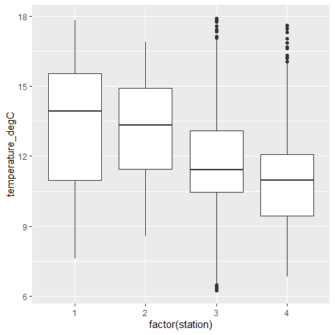<!-- -->

3.  Plot temperature by depth for samples from 2016, coloring the points
    by station

``` r
datasubset <- fieldData %>% filter(date==20160908)

ggplot(data = datasubset, mapping = aes(x = temperature_degC, y = depth_m)) + 
  geom_point(aes(color=factor(station))) 
```

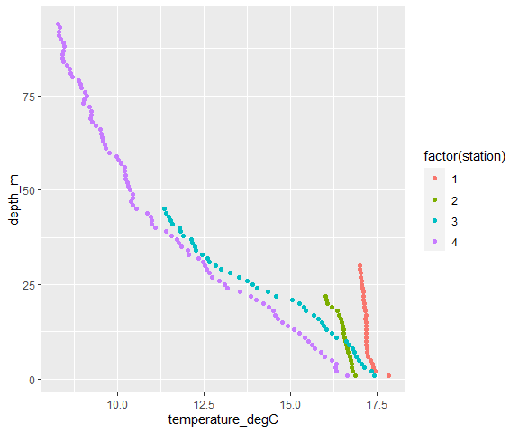<!-- -->

## Challenge B

What are the steps we need to take to manipulate our data into a data
frame with three columns: cruise, station and fluorescence averaged over
the top 2 m? Describe the step and say the associated `dplyr` data frame
manipulation functions you would use to do it.

1.  Select the rows where the depth is 2 m or less (use `filter`)
2.  Separate the data into date and station groups (use `group_by`)
3.  Take the average for each group of data (use `summarize`)

Use the pipes to connect all three steps together.

## Challenge C

1.  Create a `geom_tile` plot for temperature\_degC from the cruise that
    took place on Septh 12th 2017.

``` r
cruiseData <- filter(fieldData, date==20160908)
ggplot(cruiseData,aes(x=station,y=depth_m)) +
  geom_tile(aes(fill=temperature_degC)) +
  labs(fill='temperature (degC') +
  scale_y_reverse()
```

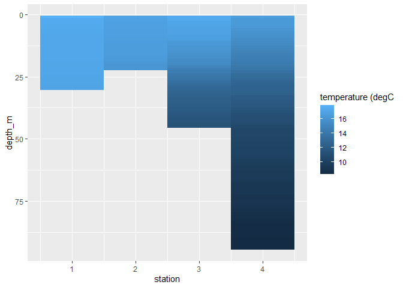<!-- -->

2.  Are there any examples from your own data that you could plot in
    this way?

[Here’s an example with genomic
data](https://science.sciencemag.org/content/sci/358/6366/1046/F2.large.jpg)
that was created using `geom_tile`.

## Challenge D

Create a plot like the above that shows temperature interpolated by
depth and latitude for the cruise that took place on Sept 12th 2017.

``` r
#filter based on cruise date
cruiseData <- filter(fieldData, date==20170912)

#interpolate our data:
interpReference <- interp(cruiseData$latitude, cruiseData$depth_m, cruiseData$temperature_degC)

# making data frame from all combinations of latitude and depth
CruiseDataInterp <- expand.grid(latitude=interpReference$x,
                                depth = interpReference$y) %>%
  mutate(temperature = as.vector(interpReference$z))


ggplot(CruiseDataInterp, aes(x=latitude, y=depth)) +
  geom_tile(aes(fill = temperature)) +
  geom_contour(aes(z = temperature),color="white") +
  geom_point(data = cruiseData, aes(x=latitude, y=depth_m),color="black") + #adding in the measurement locations
  scale_y_reverse() +
  scale_x_reverse() + #so station1 is on the left and station4 is on the right
  labs(y="Depth (m)", fill="temperature (degC)") +
  scale_fill_distiller(palette="Greens",direction=1)
```

    ## Warning: Removed 546 rows containing non-finite values (stat_contour).

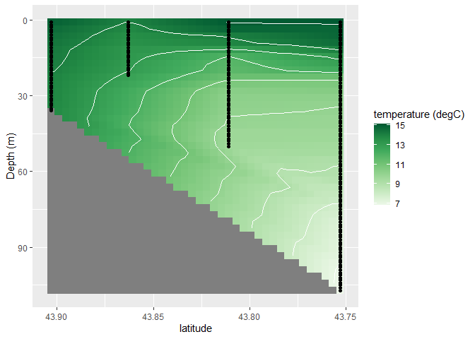<!-- -->

## Challenge E

Create a plot like the above that shows fluorescence interpolated by
depth and latitude for every cruise in 2016 (one plot per cruise). To
get a list of all the dates of cruises in 2016 do
`unique(data2016$date)` and look at the object printed to the console.

Reminder of the function:

``` r
cruiseInterpolationPlot <- function(dataframe, variable, cruiseDate, colorlabel){
  # return a heatmap style plot for a variable interpolated over latitude and 
  # depth
  # Inputs: dataframe = raw data frame of the DamariscottaRiverData
  #         variable = data frame column name (as a string) of the variable to
  #                    interpolate
  #         cruiseData = numeric value of date in yyyymmdd (to compare with the
  #                      dataframe$date column)
  #         colorlabel = label for the color bar (as a string)
  
  cruiseData <- dataframe %>% filter(date == cruiseDate)
  
  #interpolate our data:
  interpReference <- interp(cruiseData$latitude, cruiseData$depth_m, cruiseData[[variable]])
 
  newdf <- expand.grid(latitude=interpReference$x,
                                depth_m = interpReference$y) %>%
  mutate(varname = as.vector(interpReference$z))
   
  p <- ggplot(newdf, aes(x=latitude, y=depth_m)) +
    geom_tile(aes(fill = varname)) +
    geom_contour(aes(z = varname),color="white") +
    geom_point(data = cruiseData, aes(x=latitude, y=depth_m),color="black") + #adding in the measurement locations
    scale_y_reverse() +
    scale_x_reverse() + #so station1 is on the left and station4 is on the right
    labs(y="Depth (m)", fill=colorlabel, title = cruiseDate) +
    scale_fill_distiller(palette="Greens",direction=1)
  
  return(p)
  
}
```

``` r
data2016 <- fieldData %>% filter(year == 2016)
unique(data2016$date)
```

    ## [1] 20160908 20160920 20161004 20161019 20161101

``` r
cruiseInterpolationPlot(fieldData,'fluorescence_mg_m3',20160920,'fluorescence')
```

    ## Warning: Removed 552 rows containing non-finite values (stat_contour).

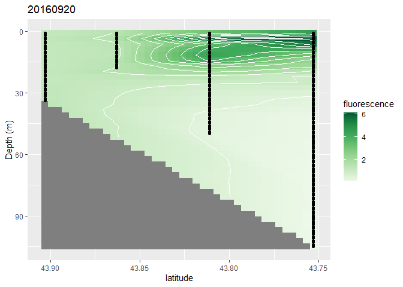<!-- -->

``` r
cruiseInterpolationPlot(fieldData,'fluorescence_mg_m3',20161004,'fluorescence')
```

    ## Warning: Removed 491 rows containing non-finite values (stat_contour).

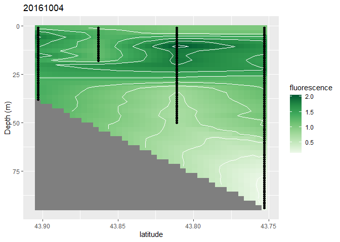<!-- -->

``` r
cruiseInterpolationPlot(fieldData,'fluorescence_mg_m3',20161019,'fluorescence')
```

    ## Warning: Removed 522 rows containing non-finite values (stat_contour).

<!-- -->

``` r
cruiseInterpolationPlot(fieldData,'fluorescence_mg_m3',20161101,'fluorescence')
```

    ## Warning: Removed 572 rows containing non-finite values (stat_contour).

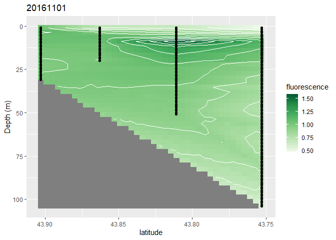<!-- -->

## Challenge F

Adapt the `cruiseInterpolationPlot` function such that the x, y and
color bar limits are determined from input arguments and re-plot all the
fluorescence data for each cruise in 2016. (Hint: use the `xlim` and
`ylim` functions with `ggplot` and include the `limits` argument in the
`scale_fill_distiller` function.)

``` r
cruiseInterpolationPlot <- function(dataframe, variable, cruiseDate, colorlabel, xlims, ylims, clims){
  # return a heatmap style plot for a variable interpolated over latitude and 
  # depth
  # Inputs: dataframe = raw data frame of the DamariscottaRiverData
  #         variable = data frame column name (as a string) of the variable to
  #                    interpolate
  #         cruiseData = numeric value of date in yyyymmdd (to compare with the
  #                      dataframe$date column)
  #         colorlabel = label for the color bar (as a string)
  #         xlims = vector with min and max values for x-axis
  #         ylims = vector with min and max values for y-axis
  #         clims = vector with min and max values for colorbar
  
  cruiseData <- dataframe %>% filter(date == cruiseDate)
  
  #interpolate our data:
  interpReference <- interp(cruiseData$latitude, cruiseData$depth_m, cruiseData[[variable]])
 
  newdf <- expand.grid(latitude=interpReference$x,
                                depth_m = interpReference$y) %>%
  mutate(varname = as.vector(interpReference$z))
   
  p <- ggplot(newdf, aes(x=latitude, y=depth_m)) +
    geom_tile(aes(fill = varname)) +
    geom_contour(aes(z = varname),color="white") +
    geom_point(data = cruiseData, aes(x=latitude, y=depth_m),color="black") +
    labs(y="Depth (m)", fill=colorlabel, title = cruiseDate) +
    scale_fill_distiller(palette="Greens",direction=1, limits=clims) +
    xlim(xlims) +
    ylim(ylims)
  
  return(p)
  
}
```

``` r
data2016 <- fieldData %>% filter(year == 2016)
alldates <- unique(data2016$date) 

for (dd in alldates){
  print(cruiseInterpolationPlot(fieldData,'fluorescence_mg_m3',dd,
                                'fluorescence', c(43.91,43.75), c(105,0), c(0,12)))
}
```

    ## Warning: Removed 557 rows containing non-finite values (stat_contour).

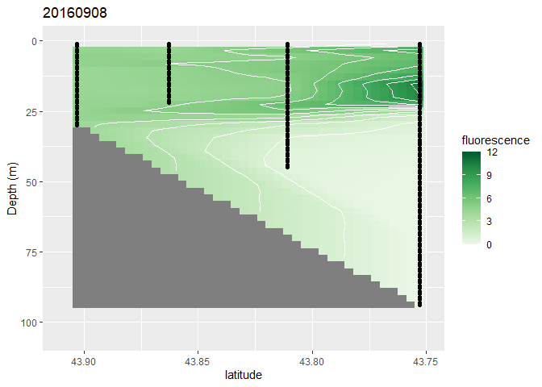<!-- -->

    ## Warning: Removed 552 rows containing non-finite values (stat_contour).

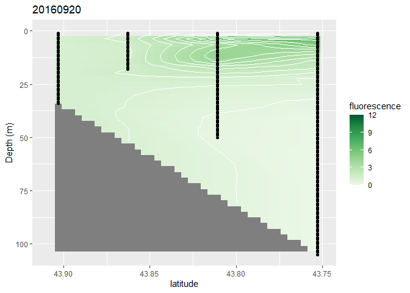<!-- -->

    ## Warning: Removed 491 rows containing non-finite values (stat_contour).

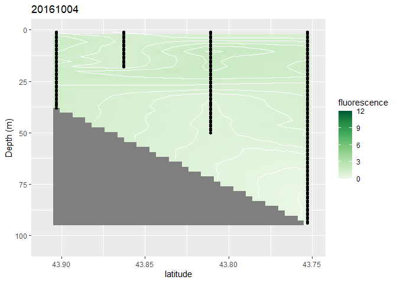<!-- -->

    ## Warning: Removed 522 rows containing non-finite values (stat_contour).

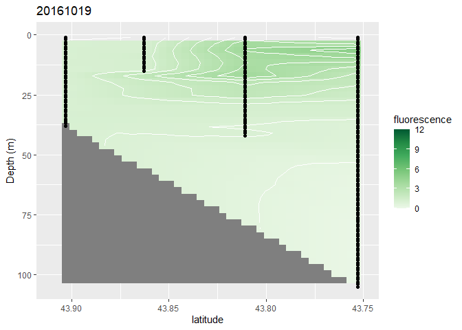<!-- -->

    ## Warning: Removed 572 rows containing non-finite values (stat_contour).

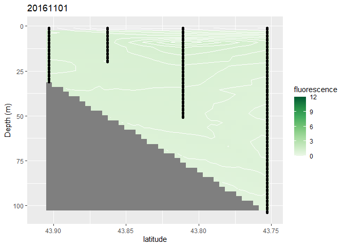<!-- -->
