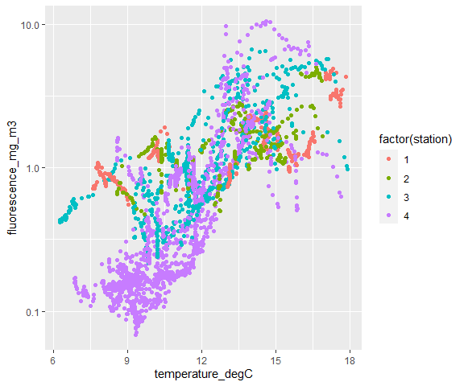
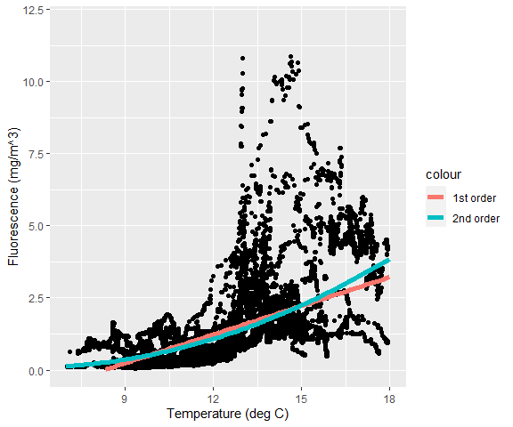
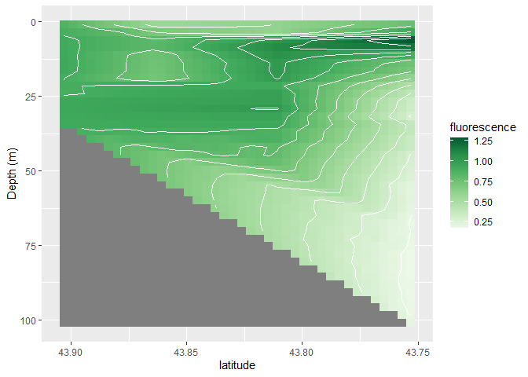
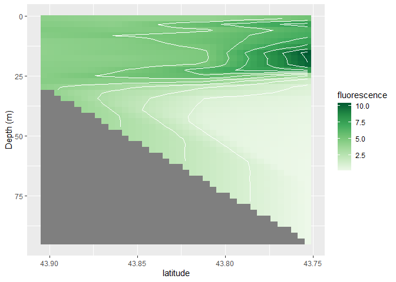
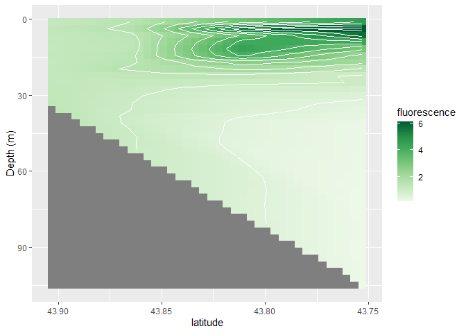
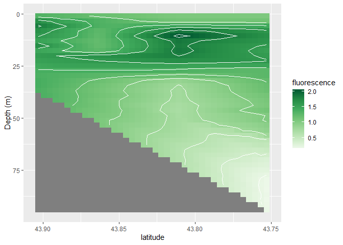
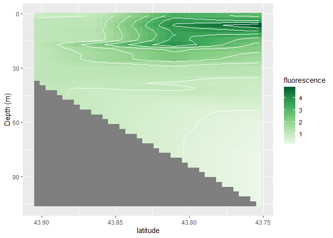
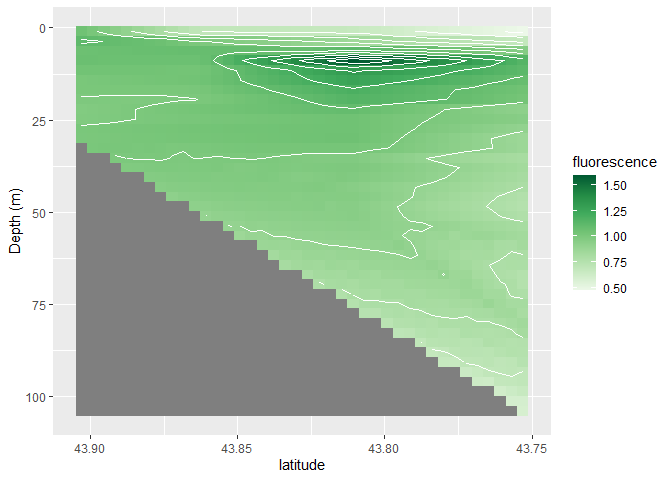

Plotting Ocean Data With R
================

# 0. Notes

-   **This notebook needs to be carpentry-ified.**
-   Using slimmed down CTD data from years 2016 - 2018. Might change
    later
-   Currently kept dates in the YYYYMMDD format, but also included year,
    month and day columns
-   Useful to have axes labeling and limit setting in the ggplot calls?
-   eqn of line? y = mx + b? y = ax + b? y = mx + c?

# 1. Getting setup

## Initialize session

Let’s start by setting our working directory by either:

1.  Running the following code at the Console:

``` r
#setwd('X:/cmitchell/teaching-mentoring/01-BigelowTeaching/carpentriesWorkshops/April2021-RIntro/plottingOceanDataWithR/')
```

2.  Navigating to the correct directory in the “Files” window in the
    bottom right of RStudio, then hitting “More &gt; Set As Working
    Directory”

3.  Selecting the `Session` menu at the top of RStudio, then
    `Select Working Directory > Choose Directory`, and navigate to the
    appropriate directory

And we’ll load the `tidyverse` library:

``` r
library(tidyverse)
```

    ## -- Attaching packages --------------------------------------- tidyverse 1.3.0 --

    ## v ggplot2 3.3.2     v purrr   0.3.4
    ## v tibble  3.0.3     v dplyr   1.0.2
    ## v tidyr   1.1.2     v stringr 1.4.0
    ## v readr   1.3.1     v forcats 0.5.0

    ## -- Conflicts ------------------------------------------ tidyverse_conflicts() --
    ## x dplyr::filter() masks stats::filter()
    ## x dplyr::lag()    masks stats::lag()

## Importing the data

We’re going to use some water column data from the Damariscotta River.
The data spans XX years and is at four locations along the river.

\[how much of a description of what the data are do you think we need\]

The data file is located at XXXXX (on Google Drive?). If you haven’t
already, please download the file and put save it in your working
directory.

Let’s read the data into a data frame:

``` r
fieldData <- read_csv('DamariscottaRiverData.csv')
```

    ## Parsed with column specification:
    ## cols(
    ##   date = col_double(),
    ##   year = col_double(),
    ##   month = col_double(),
    ##   day = col_double(),
    ##   station = col_double(),
    ##   depth_m = col_double(),
    ##   temperature_degC = col_double(),
    ##   salinity_psu = col_double(),
    ##   density_kg_m3 = col_double(),
    ##   PAR = col_double(),
    ##   fluorescence_mg_m3 = col_double(),
    ##   oxygenConc_umol_kg = col_double(),
    ##   oxygenSaturation_percent = col_double(),
    ##   latitude = col_double()
    ## )

What does this data look like?

``` r
head(fieldData)
```

    ## # A tibble: 6 x 14
    ##     date  year month   day station depth_m temperature_degC salinity_psu
    ##    <dbl> <dbl> <dbl> <dbl>   <dbl>   <dbl>            <dbl>        <dbl>
    ## 1 2.02e7  2016     9     8       1   0.917             17.9         32.0
    ## 2 2.02e7  2016     9     8       1   0.92              17.9         32.0
    ## 3 2.02e7  2016     9     8       1   0.916             17.9         32.0
    ## 4 2.02e7  2016     9     8       1   0.916             17.9         32.0
    ## 5 2.02e7  2016     9     8       1   0.921             17.9         32.0
    ## 6 2.02e7  2016     9     8       1   0.916             17.9         32.0
    ## # ... with 6 more variables: density_kg_m3 <dbl>, PAR <dbl>,
    ## #   fluorescence_mg_m3 <dbl>, oxygenConc_umol_kg <dbl>,
    ## #   oxygenSaturation_percent <dbl>, latitude <dbl>

# 2. Scatter plots and linear regressions

Yesterday we learned how to make scatter plots to visualize
relationships between data. But often we need to quantify those
relationships. We’re going to revisit scatter plots today, but with a
focus on linear regressions and including regression lines on scatter
plots.

## 2.1 Scatter plots

Let’s look at how chlorophyll fluorescence is related to temperature.

``` r
ggplot(data = fieldData, mapping = aes(x = temperature_degC, y = fluorescence_mg_m3)) + 
  geom_point() +
  xlab('Temperature (deg C)') +
  ylab('Fluorescence (mg/m^3)') +
  xlim(7,18) + ylim(0,12)
```

    ## Warning: Removed 198 rows containing missing values (geom_point).

<!-- -->

In the above figure, we have a lot of fluorescence data below 2.5 mg
m<sup> − 3</sup> - in fact, the majority of our data are below that
value. In this case (and as often happens with geophysical data), it is
more useful to plot (& perform statistics on) the log-transformed data,
so we can better understand the relationship between the parameters.

Let’s plot the relationship between temperature and log-transformed
fluorescence:

``` r
ggplot(data = fieldData, mapping = aes(x = temperature_degC, y = fluorescence_mg_m3)) + 
  geom_point() +
  xlab('Temperature (deg C)') +
  ylab('Fluorescence (mg/m^3)') +
  xlim(7,18) +  scale_y_log10(limits=c(0.07,12)) 
```

    ## Warning: Removed 211 rows containing missing values (geom_point).

<!-- -->

OK great - so we can visualize the relationship between fluorescence and
temperature. But how do we include a linear regression?

## 2.2 Linear regressions

To do a linear regression, we need to fit a linear model to our data.

**Note: we are not going into the statistics here, or details of whether
it’s appropriate to do a linear regression on these data - we are just
showing you *how* you would do a linear regression with your own data if
you so wished.**

Let’s start with looking at fluorescence and temperature. To visualize
the linear model, we can add in `geom_smooth(model=lm)` to our plot:

``` r
ggplot(data = fieldData, mapping = aes(x = temperature_degC, y = fluorescence_mg_m3)) + 
  geom_point() +
  geom_smooth(method='lm') +
  xlab('Temperature (deg C)') +
  ylab('Fluorescence (mg/m^3)') +
  xlim(7,18) + ylim(0,12)
```

    ## `geom_smooth()` using formula 'y ~ x'

    ## Warning: Removed 198 rows containing non-finite values (stat_smooth).

    ## Warning: Removed 198 rows containing missing values (geom_point).

    ## Warning: Removed 11 rows containing missing values (geom_smooth).

<!-- -->

But how do we get the equation and goodness of fit statistics?

``` r
# fitting a linear model between the two variables
model1 <- lm(fieldData$fluorescence_mg_m3 ~ fieldData$temperature_degC)

#display results of linear model
summary(model1)
```

    ## 
    ## Call:
    ## lm(formula = fieldData$fluorescence_mg_m3 ~ fieldData$temperature_degC)
    ## 
    ## Residuals:
    ##     Min      1Q  Median      3Q     Max 
    ## -2.5066 -0.5602 -0.1425  0.2559  9.2462 
    ## 
    ## Coefficients:
    ##                             Estimate Std. Error t value Pr(>|t|)    
    ## (Intercept)                -2.739470   0.032767   -83.6   <2e-16 ***
    ## fieldData$temperature_degC  0.330775   0.002691   122.9   <2e-16 ***
    ## ---
    ## Signif. codes:  0 '***' 0.001 '**' 0.01 '*' 0.05 '.' 0.1 ' ' 1
    ## 
    ## Residual standard error: 0.9568 on 21018 degrees of freedom
    ## Multiple R-squared:  0.4182, Adjusted R-squared:  0.4181 
    ## F-statistic: 1.511e+04 on 1 and 21018 DF,  p-value: < 2.2e-16

How do we access these different values and assign them to objects?

``` r
# assigning the slope and intercept fromt the model to variables
intercept <- model1$coefficients[1]
slope <- model1$coefficients[2]

sum_model1 <- summary(model1)

rsquare <- sum_model1$r.squared
adjrsquare <- sum_model1$adj.r.squared
std_error <- sum_model1$sigma
```

Once we have our linear model (i.e. the equation of our line), there are
other ways to add the line to the figure: `geom_abline` and
`stat_function`. Let’s look at `stat_function`. To use `stat_function`,
we need to provide it with a function that describes the equation of our
model. In this example, we used a linear model to find a straight line,
so we need to give `stat_function` a function that describes the
equation of a line (`y = mx + b`):

``` r
ggplot(data = fieldData, mapping = aes(x = temperature_degC, y = fluorescence_mg_m3)) + 
  geom_point() +
  stat_function(fun = function(x) intercept + slope * x, size = 2, color = 'cyan') +
  xlab('Temperature (deg C)') +
  ylab('Fluorescence (mg/m^3)') +
  xlim(7,18) + ylim(0,12)
```

    ## Warning: Removed 198 rows containing missing values (geom_point).

    ## Warning: Removed 12 row(s) containing missing values (geom_path).

<!-- -->

Why is this useful? Why don’t we just always use `geom_smooth`? One of
the benefits of `stat_function` is that we can use it to plot *any* kind
of line - it doesn’t need to be a straight line. For example, say we
wanted to fit a 2nd order polynomial (a quadratic) to our data we could
do the following:

``` r
# fitting a linear model between the two variables
model2 <- lm(fieldData$fluorescence_mg_m3 ~ fieldData$temperature_degC + I(fieldData$temperature_degC^2))

# assigning the coefficients from the models to the variables
p2 <- model2$coefficients[3]
p1 <- model2$coefficients[2]
p0 <- model2$coefficients[1]

ggplot(data = fieldData, mapping = aes(x = temperature_degC, y = fluorescence_mg_m3)) + 
  geom_point() +
  stat_function(fun = function(x) intercept + slope * x, size = 2, aes(color='1st order')) +
  stat_function(fun = function(x) p0 + p1 * x + p2 * (x^2), size = 2, aes(color='2nd order')) +
  xlab('Temperature (deg C)') +
  ylab('Fluorescence (mg/m^3)') +
  xlim(7,18) + ylim(0,12)
```

    ## Warning: Removed 198 rows containing missing values (geom_point).

    ## Warning: Removed 12 row(s) containing missing values (geom_path).

<!-- -->

Or something even more complicated, such as a model between the
temperature and log-transformed fluorescence:

``` r
modelLog <- lm(log10(fieldData$fluorescence_mg_m3) ~ fieldData$temperature_degC)
interceptLog <- modelLog$coefficients[1]
slopeLog <- modelLog$coefficients[2]

ggplot(data = fieldData, mapping = aes(x = temperature_degC, y = fluorescence_mg_m3)) + 
  geom_point() +
  stat_function(fun = function(x) intercept + slope * x, size = 2, aes(color='1st order')) +
  stat_function(fun = function(x) p0 + p1 * x + p2 * (x^2), size = 2, aes(color='2nd order')) +
  stat_function(fun = function(x) 10**interceptLog * (10**(slopeLog * x)), size = 2, aes(color = 'power')) +
  xlab('Temperature (deg C)') +
  ylab('Fluorescence (mg/m^3)') +
  xlim(7,18) + ylim(0,12)
```

    ## Warning: Removed 198 rows containing missing values (geom_point).

    ## Warning: Removed 12 row(s) containing missing values (geom_path).

<!-- -->

\[write something in here about applicability of this type of analysis
on these data\]

# 3. Visualizing 2D patterns on regular grids (need better title)

Here, we are thinking about visualizing one variable based on two other
variables. For example, how does surface chlorophyll fluorescence change
at each station over the course of a sampling season? Or OTHER EXAMPLES?

For our data set, let’s consider surface chlorophyll fluorescence at
each station over the 2016 sampling season. We are going to create a
couple of different figures that show surface chlorophyll fluorescence
with date along the x-axis and station along the y-axis. Before creating
the figures, we need to do some data manipulation to wrangle our data
into a new data frame that contains 3 columns: date, station and surface
chlorophyll fluorescence.

## 3.1 Data Manipulation

### Dates

Our data frame contains data from 2016 - 2018, so we first need to
`filter` the data frame (select rows based on a specific criterion):

``` r
data2016 <- filter(fieldData, year == 2016)

#check our results
summary(data2016)
```

    ##       date               year          month             day       
    ##  Min.   :20160908   Min.   :2016   Min.   : 9.000   Min.   : 1.00  
    ##  1st Qu.:20160920   1st Qu.:2016   1st Qu.: 9.000   1st Qu.: 4.00  
    ##  Median :20161004   Median :2016   Median :10.000   Median : 8.00  
    ##  Mean   :20160996   Mean   :2016   Mean   : 9.856   Mean   :10.29  
    ##  3rd Qu.:20161019   3rd Qu.:2016   3rd Qu.:10.000   3rd Qu.:19.00  
    ##  Max.   :20161101   Max.   :2016   Max.   :11.000   Max.   :20.00  
    ##     station         depth_m        temperature_degC  salinity_psu  
    ##  Min.   :1.000   Min.   :  0.867   Min.   : 8.26    Min.   :31.66  
    ##  1st Qu.:2.000   1st Qu.: 12.516   1st Qu.:11.29    1st Qu.:32.34  
    ##  Median :3.000   Median : 28.120   Median :12.78    Median :32.67  
    ##  Mean   :2.938   Mean   : 35.875   Mean   :12.80    Mean   :32.61  
    ##  3rd Qu.:4.000   3rd Qu.: 52.546   3rd Qu.:14.33    3rd Qu.:32.87  
    ##  Max.   :4.000   Max.   :105.090   Max.   :17.92    Max.   :33.25  
    ##  density_kg_m3        PAR            fluorescence_mg_m3 oxygenConc_umol_kg
    ##  Min.   :22.99   Min.   :   0.0001   Min.   : 0.0672    Min.   : 85.77    
    ##  1st Qu.:24.06   1st Qu.:   0.0001   1st Qu.: 0.5944    1st Qu.:105.07    
    ##  Median :24.68   Median :   0.2500   Median : 1.0629    Median :117.34    
    ##  Mean   :24.56   Mean   :  64.1388   Mean   : 1.5905    Mean   :126.20    
    ##  3rd Qu.:25.12   3rd Qu.:  16.0250   3rd Qu.: 1.6160    3rd Qu.:140.42    
    ##  Max.   :25.59   Max.   :2050.0000   Max.   :10.8782    Max.   :262.38    
    ##  oxygenSaturation_percent    latitude    
    ##  Min.   : 31.02           Min.   :43.75  
    ##  1st Qu.: 38.57           1st Qu.:43.75  
    ##  Median : 44.36           Median :43.81  
    ##  Mean   : 48.21           Mean   :43.81  
    ##  3rd Qu.: 53.61           3rd Qu.:43.86  
    ##  Max.   :105.24           Max.   :43.90

One of the variables we want to plot is date. We currently have date
stored as a number in the format yyyymmdd, and in separate year, month
and day columns. If we used the yyyymmdd data for plotting date, our
dates would be spaced out incorrectly because R recognises this as a
number. Let’s look the dates we have samples from:

``` r
unique(data2016$date)
```

    ## [1] 20160908 20160920 20161004 20161019 20161101

The second date is September 20th and the third is October 4th - a gap
of 14 days. But R sees that as a gap of 84 (20161004-20160920), hence
the spacing along the given axis would be incorrect.

What we need to do is format our dates in a way R recognises them as
dates. Let’s use the `ymd` function from yesterday to convert the dates,
and the `mutate` function to add the reformatted dates to our data
frame.

### Surface data

We have data that spans from the surface to a maximum depth of 105 m,
but we only want the surface data. These data are measured from a
profiling instrument - so the depths are slightly different for every
station and we can’t filter our new `data2016new` data frame based on
one depth value. There are a few different ways to deal with this, and
the exact choices you make will depend on your data and your situation.
Here, we are going to say surface chlorophyll fluorescence is the
average value over the top 2 m. What that means is for every cruise and
station, we need to calculate the average chlorophyll fluorescence in
the top 2 m.

Let’s think about the steps we need to take to manipulate our data into
that format:

1.  Select the rows where the depth is less than 2 m (use `filter`)
2.  Separate the data into date and station groups (use `group_by`)
3.  Take the average for each group of data (use `summarize`)

And we are going to use the pipes to connect this all together.

``` r
chldata2016 <- data2016new %>% filter(depth_m < 2) %>% group_by(station,rdate) %>% summarize(surf_chl = mean(fluorescence_mg_m3))
```

    ## `summarise()` regrouping output by 'station' (override with `.groups` argument)

``` r
head(chldata2016)
```

    ## # A tibble: 6 x 3
    ## # Groups:   station [2]
    ##   station rdate      surf_chl
    ##     <dbl> <date>        <dbl>
    ## 1       1 2016-09-08    4.32 
    ## 2       1 2016-09-20    1.20 
    ## 3       1 2016-10-04    1.32 
    ## 4       1 2016-10-19    0.897
    ## 5       1 2016-11-01    1.06 
    ## 6       2 2016-09-08    4.07

We’ve manipulated our data into the form we need to now plot it.
*However* in the process, we made two extra data frames that we are not
going to use anymore: `data2016` and `data2016new`. At each step of our
manipulating, we needed to try and keep track of which data frame to use
where. With only two it’s maybe OK to keep on top of, but if there are a
lot more steps, you can sometimes get lost in sea of data frames. Pipes
can really help keep your environment free of unnecessary
variables/objects.

In our case, we could have actually used pipes to do all the
manipulations in one command:

``` r
chldata2016 <- fieldData %>% filter(year == 2016) %>% mutate(rdate = ymd(data2016$date)) %>% filter(depth_m < 2) %>% group_by(station,rdate) %>% summarize(surf_chl = mean(fluorescence_mg_m3))
```

    ## `summarise()` regrouping output by 'station' (override with `.groups` argument)

In fact, the order of the first two commands doesn’t matter, so to
simplify this long command, we could switch the order of the first two
commands, then combine the two calls to `filter` into one:

``` r
chldata2016 <- fieldData %>% mutate(rdate = ymd(date)) %>% filter(year == 2016, depth_m < 2) %>% group_by(station,rdate) %>% summarize(surf_chl = mean(fluorescence_mg_m3))
```

    ## `summarise()` regrouping output by 'station' (override with `.groups` argument)

## 3.2 Visualizing data using a contour plot

``` r
ggplot(chldata2016,aes(x=rdate,y=station)) +
  geom_contour_filled(aes(z=surf_chl)) +
  geom_point() +
  labs(fill='surface chlorophyll fluorescence (mg m^-3)') +
  theme(panel.background = element_rect(fill = "white", colour = "white"))
```

<!-- -->

#### Aside \#1: Date Formatting

You can format the date in different ways by including a
`scale_x_date(date_labels='fmt')` argument in your `ggplot` function,
where `'fmt'` is your required date format. Here’s a handy table showing
different date formats (from
[here](https://www.statmethods.net/input/dates.html)):


So to format your dates as e.g. October-01, you’d use
`scale_x_date(date_labels='%B-%d')`.

#### Aside \#2: Repositioning x-ticks and x-tick labels

WANT TO INCLUDE THIS??

## 3.3 Visualizing data using a XXXXX??

# 4. Interpolating and visualizing data

The approach in previous section works well when your data are
consistent in terms of the variables you want to compare. For the data
we plotted above, there were five different cruises, and on each cruise,
data was collected at the same four locations. We had data for every
cruise and station. If we’d been missing data at one of the stations on
one of the cruises, we’d just have a blank part on the plots we made.
But what if we were missing a lot of data - would the above approach
still be a good way to visualize our data?

To dig into this a bit further, let’s consider how chlorophyll
fluorescence varies by depth at each station *for one cruise*.

We need to do a bit of data manipulation again to create a data frame
we’ll use for plotting. In this case, we’re going to have station on the
x-axis and depth on the y-axis, and we’ll consider the cruise that took
place on September 8th 2016.

``` r
cruiseData <- filter(fieldData, date==20160908)
```

We now have a data frame that includes columns for depth, station and
chlorophyll fluorescence for just one cruise - so let’s use the same
approach as before to create a contour plot:

``` r
ggplot(cruiseData,aes(x=station,y=depth_m)) +
  geom_contour_filled(aes(z=fluorescence_mg_m3)) +
  geom_point() +
  labs(fill='surface chlorophyll fluorescence (mg m^-3)') +
  scale_y_reverse() +
  theme(panel.background = element_rect(fill = "white", colour = "white"))
```

    ## Warning: stat_contour(): Zero contours were generated

    ## Warning in min(x): no non-missing arguments to min; returning Inf

    ## Warning in max(x): no non-missing arguments to max; returning -Inf

<!-- -->

We end up with no contours! What’s going on here? To draw the contours,
R needs the y values need to all be at the same intervals (similarly for
the x values). For our data, the depths at each station are irregular
and different from each other:

``` r
ggplot(cruiseData, aes(x=fluorescence_mg_m3, y=depth_m, color = factor(station))) +
  geom_point() +
  labs(color='Station') +
  ylim(5,1) + xlim(3,9)
```

    ## Warning: Removed 1187 rows containing missing values (geom_point).

<!-- -->

\[example of a different type of data you might want to do this on??\]

So we need to sort the depth data onto a regular grid - to do this we
will need to group the data into depth bins (or depth ranges) and then
calculate the mean for each depth bin. Let’s bin our data into 1 m
intervals. Again, we’re making a decision here based on our particular
data set and situation, this could be different for you.

We are going to use a very similar process to earlier (when we
considered surface chlorophyll fluorescence on all cruises in 2016).

1.  Round the depths to the nearest meter and include as column in the
    data frame (use `mutate`)
2.  Separate the data into depth bin and station groups (use `group_by`)
3.  Take the average for each group of data (use `summarize`)

``` r
binned <- cruiseData %>% mutate(depthBin = round(depth_m)) %>% group_by(station,depthBin) %>% summarize(av_fluor = mean(fluorescence_mg_m3))
```

    ## `summarise()` regrouping output by 'station' (override with `.groups` argument)

``` r
head(binned)
```

    ## # A tibble: 6 x 3
    ## # Groups:   station [1]
    ##   station depthBin av_fluor
    ##     <dbl>    <dbl>    <dbl>
    ## 1       1        1     4.31
    ## 2       1        2     4.60
    ## 3       1        3     4.54
    ## 4       1        4     4.52
    ## 5       1        5     4.92
    ## 6       1        6     4.73

We’ve now got a data frame like we had before - let’s try
`geom_contour_filled` again:

``` r
ggplot(binned,aes(x=station,y=depthBin)) +
  geom_contour_filled(aes(z=av_fluor)) +
  geom_point() +
  labs(fill='surface chlorophyll fluorescence (mg m^-3)') +
  scale_y_reverse()
```

<!-- -->

This looks better, but what this plotting function doesn’t do is
interpolate data between missing data points. We know we have data at
station 4 below 50 m that isn’t represented in this plot. Can we use a
different function to show those data too?

``` r
ggplot(binned,aes(x=station,y=depthBin)) +
  geom_tile(aes(fill=av_fluor)) +
  scale_fill_continuous() +
  labs(fill='surface chlorophyll fluorescence (mg m^-3)') +
  scale_y_reverse()
```

<!-- -->

All the data are visualized when we plot the data this way. However, in
this case (and all previous examples!), our x-axis is station number
i.e. it is a given location. We might want to space out the data on the
x-axis based on those locations, rather than station number, so we can
visualize our data with a representative separation between the data
points. For this data set, the stations are on a similar longitude, so
looking at latitude will give a good representation of the separation
between the stations. But this could be distance along cruise track or
field transect, or XXXX

THIS NEXT BIT OF CODE IS INCLUDED HERE FOR NOW - MEANING TO INCLUDE
LATITUDES IN ORIGINAL DF (unless we think it’s worth including a
complicated if else)

``` r
#binned %>% mutate(latitude = ifelse(binned$station == 1, 43.903,ifelse(binned$station == 2, 43.863,ifelse(binned$station == 3, 43.811,ifelse(binned$station == 4,43.753,NaN)))))


binned <- cruiseData %>% mutate(depthBin = round(cruiseData$depth_m)) %>% group_by(latitude,depthBin) %>% summarize(av_fluor = mean(fluorescence_mg_m3))
```

    ## `summarise()` regrouping output by 'latitude' (override with `.groups` argument)

``` r
head(binned)
```

    ## # A tibble: 6 x 3
    ## # Groups:   latitude [1]
    ##   latitude depthBin av_fluor
    ##      <dbl>    <dbl>    <dbl>
    ## 1     43.8        1     5.33
    ## 2     43.8        2     6.11
    ## 3     43.8        3     7.54
    ## 4     43.8        4     7.08
    ## 5     43.8        5     6.61
    ## 6     43.8        6     6.56

``` r
ggplot(binned,aes(x=latitude,y=depthBin)) +
  geom_tile(aes(fill=av_fluor)) +
  scale_fill_continuous() +
  labs(fill='surface chlorophyll fluorescence (mg m^-3)') +
  scale_y_reverse() +
  scale_x_reverse() #flipping the x-axis too, so station 1 is on the left
```

<!-- -->

What we end up with is this plot where we have gaps between each station
measurement because our sampling stations are not equally spaced in
terms of latitude. What we can do is estimate what the chlorophyll
fluorescence would be in between where we have our samples i.e. we can
interpolate our data.

We are going to do the bilinear interpolation on our data, which means
we are going to estimate chlorophyll fluorescence values over regularly
spaced latitude and depth values. We’re going to use a handy function
from the `akim` package to do all the hard work for us:

\[appropriate place to include the install package?\]

``` r
library(akima)
```

    ## Warning: package 'akima' was built under R version 4.0.3

``` r
#interpolate our data:
interpReference <- interp(binned$latitude, binned$depthBin, binned$av_fluor)
```

What does `interpReference` look like? It is a list with 3 items:

1.  `x`, which is a list of 40, regularly spaced latitudes
2.  `y`, which is a list of 40, regularly spaced depths
3.  `z`, which is a 40 x 40 grid (or **matrix**), where each **element**
    (number in the grid) corresponds to one of the depth (columns) and
    latitude (rows) values. For example,
    1.  the `z` value in the first row and first column corresponds to
        the first latitude and depth values
    2.  the `z` value in the first row and second column corresponds to
        the first latitude, and second depth value
    3.  the `z` value in the second row and first column corresponds to
        the second latitude, and first depth value

What we now need to do is get our data into a data frame format for
`ggplot`. One way to do this is turn the latitude and depth values into
a 40 x 40 grid too, and then reshape the data into a data frame.

``` r
# making the grids of latitude and depth
# Note - we need to "transpose" the matrix for the depth data,
# i.e. we need to flip the rows and columns around
lat <- matrix(interpReference$x,ncol=40,nrow=40)
depth <- t(matrix(interpReference$y,ncol=40,nrow=40))

# we need to "flatten" our grids into lists (the as.vector command)
fluor <- as.vector(interpReference$z)
lats <- as.vector(lat)
depths <- as.vector(depth)

# finally, putting the lists together as a dataframe
CruiseDataInterp <- data.frame(fluorescence = fluor, latitude = lats, depth = depths)
```

``` r
ggplot(CruiseDataInterp, aes(x=latitude, y=depth)) +
  geom_tile(aes(fill = fluorescence)) +
  scale_y_reverse() +
  scale_x_reverse() + #so station1 is on the left and station4 is on the right
  labs(y="Depth (m)", fill="fluorescence (mg m^-3)") +
  scale_fill_distiller(palette="Greens",direction=1)
```

<!-- -->
We can include the sample locations and contour lines to make it clear
where the interpolation is happening:

``` r
ggplot(CruiseDataInterp, aes(x=latitude, y=depth)) +
  geom_tile(aes(fill = fluorescence)) +
  geom_contour(aes(z = fluorescence),color="white") +
  geom_point(data = binned, aes(x=latitude, y=depthBin),color="black") + #adding in the measurement locations
  scale_y_reverse() +
  scale_x_reverse() + #so station1 is on the left and station4 is on the right
  labs(y="Depth (m)", fill="fluorescence (mg m^-3)") +
  scale_fill_distiller(palette="Greens",direction=1)
```

    ## Warning: Removed 557 rows containing non-finite values (stat_contour).

<!-- -->

Note: interpolation below measured depths - in this case (the
Damariscotta River) those interpolations don’t make sense because the
profiles are full water column i.e. depth was limited by bathymetery.
Point this out and include code to mask those points?

# For loops and functions for creating multiple versions of figures

## Writing Functions

Functions are blocks of code which when called, perform a specific task.
Usually you give them an input and they give you an output. We’ve used
lots of different R functions e.g. `ggplot`, `image.plot`, etc. We can
write our own functions for our own specific tasks. If you find yourself
copying and pasting blocks of code and changing just a couple small
parts, that’s often a good time to think about writing a function (or a
for loop - more later!)

#### Example: write a function which adds two numbers

``` r
addition <- function(a,b){
  return(a+b)
}
```

Let’s try using our function:

``` r
addition(9,3)
```

    ## [1] 12

### Function for creating a figure

The last figure we created was for one variable, for one cruise. What if
we want to look at a different variable? Or a different cruise? It would
be nice to have a function to regenerate a plot quickly.

We’re actually going to create two functions: one that deals with the
data manipulation, and one that deals with the plotting.

#### Data manipulation function

We need to think about what the inputs of our function are going to be -
these are the variables or objects we want to change e.g. variable or
cruise date. We also need to think about our output - this will be a
data frame which we can use to create a plot. As a reminder, here’s the
steps we took earlier to do the data manipulation:

1.  Filtered the original data frame based on cruise date
2.  Binned the data into 1 m intervals
3.  Interpolated the relevant variable
4.  Reshaped the data back into a data frame

Let’s combine these together into a function. The following code will
all be a copy from what we did earlier, with a couple of adjustments:

1.  A few of the object names have been generalized e.g. we’ll use
    `dataframe` rather than `fieldData`, call the column we want to plot
    `variable` rather than “hard coding” its name “fluorescence\_mg\_m3”
    and the date `cruiseDate` (as well as renaming a couple of the
    intermediate objects created along the way)
2.  We’re going to make use of the `.data` pronoun. The `.data` pronoun
    refers to data in your data frame. It’s really useful when you want
    to specify a column name to one of the `dplyr` functions as a
    character object. See
    [!this](https://tinyheero.github.io/2020/03/01/use-data-env-pronouns-tidyverse.html)
    blog post that gives a good overview of `.data` (and `.env`)
    pronouns. \[better way to do this? expand explanation with simpler
    example??\]

``` r
cruiseinterpolation <- function(dataframe, variable, cruiseDate){
  # return a data frame with a variable interpolated based on depth and latitude
  # for a given cruise data
  
  binned <- dataframe %>% filter(date == cruiseDate) %>% mutate(depthBin = round(depth_m)) %>% group_by(latitude,depthBin) %>% summarize(avg = mean(.data[[variable]]))
  
  #interpolate our data:
 interpReference <- interp(binned$latitude, binned$depthBin, binned$avg)
 
 #reshaping into a data frame
 lat <- matrix(interpReference$x,ncol=40,nrow=40)
 depth <- t(matrix(interpReference$y,ncol=40,nrow=40))
 vardata <- as.vector(interpReference$z)
 lats <- as.vector(lat)
 depths <- as.vector(depth)

 #putting the lists together as a data frame
 newdf <- data.frame(avg = vardata, latitude = lats, depth = depths)
 
 #outputting the new data frame
 return(newdf)
}
```

Next, let’s write our plotting function:

``` r
interpolationplot <- function(dataframe, variable, colorlabel){
  # returns a heatmap style plot of a variable based on latitude and depth
  
  p<- ggplot(dataframe, aes(x=latitude, y=depth)) +
  geom_tile(aes(fill = .data[[variable]])) +
  geom_contour(aes(z = .data[[variable]]),color="white") +
  #geom_point(data = binned, aes(x=latitude, y=depthBin),color="black") + #adding in the measurement locations
  scale_y_reverse() +
  scale_x_reverse() + #so station1 is on the left and station4 is on the right
  labs(y="Depth (m)", fill=colorlabel) +
  scale_fill_distiller(palette="Greens",direction=1)
  
  return(p)
  
}
```

**still need to include the locations of the data, date as title (and
colorscale limits?)**

Now we can try out our functions:

``` r
plotData <- cruiseinterpolation(fieldData, 'fluorescence_mg_m3', 20171109)
```

    ## `summarise()` regrouping output by 'latitude' (override with `.groups` argument)

``` r
interpolationplot(plotData,'avg','fluorescence')
```

    ## Warning: Removed 533 rows containing non-finite values (stat_contour).

<!-- -->

## For Loops

### For loop example

#### Example: print the statement “hello” four times

``` r
for (ii in 1:4) {
  print("hello")
}
```

    ## [1] "hello"
    ## [1] "hello"
    ## [1] "hello"
    ## [1] "hello"

Can we also print which loop iteration we are on (e.g. the first,
second, etc)?

``` r
for (ii in 1:4) {
  print(paste(ii,"hello"))
}
```

    ## [1] "1 hello"
    ## [1] "2 hello"
    ## [1] "3 hello"
    ## [1] "4 hello"

Can we build a list over a for loop? For example, let’s build a list
that contains the iteration number multiplied by 10.

``` r
mylst <- vector("list",length=4)
for (ii in 1:4) {
  mylst[[ii]] = ii*10
}
print(mylst)
```

    ## [[1]]
    ## [1] 10
    ## 
    ## [[2]]
    ## [1] 20
    ## 
    ## [[3]]
    ## [1] 30
    ## 
    ## [[4]]
    ## [1] 40

We have our functions for manipulating and plotting the data - but what
if we want to plot the chlorophyll fluorescence for every cruise in
2016? We could call our functions in a for loop.

Let’s think about what we want to loop over - we’re saying on every
iteration of our loop, we want to provide a different `cruiseDate` to
our manipulation function. So we need to first put all our dates into a
vector, then loop over them.

``` r
alldates <- unique(data2016$date) ### REWRITE ONCE I'VE FIGURED OUT WHAT DATA WILL BE IN THE DATA FILE

for (dd in alldates){
  plotData <- cruiseinterpolation(fieldData, 'fluorescence_mg_m3', dd)
  print(interpolationplot(plotData,'avg','fluorescence'))
}
```

    ## `summarise()` regrouping output by 'latitude' (override with `.groups` argument)

    ## Warning: Removed 557 rows containing non-finite values (stat_contour).

    ## `summarise()` regrouping output by 'latitude' (override with `.groups` argument)

<!-- -->

    ## Warning: Removed 552 rows containing non-finite values (stat_contour).

    ## `summarise()` regrouping output by 'latitude' (override with `.groups` argument)

<!-- -->

    ## Warning: Removed 491 rows containing non-finite values (stat_contour).

    ## `summarise()` regrouping output by 'latitude' (override with `.groups` argument)

<!-- -->

    ## Warning: Removed 522 rows containing non-finite values (stat_contour).

    ## `summarise()` regrouping output by 'latitude' (override with `.groups` argument)

<!-- -->

    ## Warning: Removed 572 rows containing non-finite values (stat_contour).

<!-- -->
