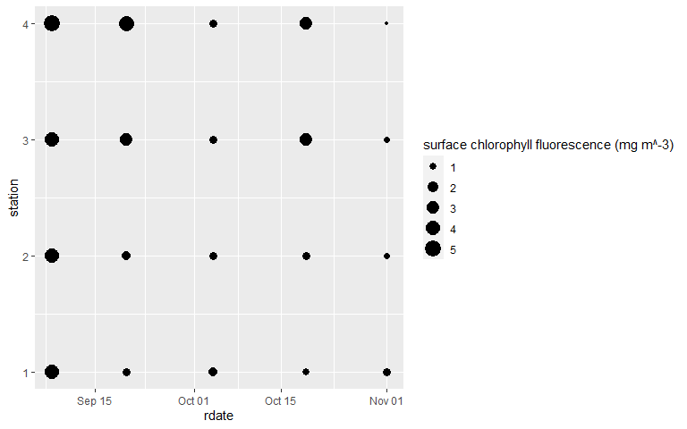
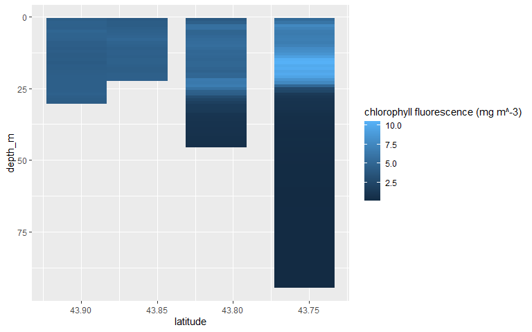

Plotting Ocean Data With R
================

# Damariscotta River cruise data

For this tutorial we’re going to use some water column data from the
Damariscotta River. The data spans 3 years and is at four locations
along the river.

There is a [GitHub
repository](https://github.com/cathmmitchell/plottingOceanDataWithR) for
this tutorial that also contains the R script we are going to work in,
the data file we are going to use, and has some additional information.
Please go there for more information and instructions on how to download
the data file and the R script.

## Initialize session

First, we’ll load the `tidyverse` library:

``` r
library(tidyverse)
```

    ## -- Attaching packages ------------------- tidyverse 1.3.0 --

    ## v ggplot2 3.3.2     v purrr   0.3.4
    ## v tibble  3.0.3     v dplyr   1.0.2
    ## v tidyr   1.1.2     v stringr 1.4.0
    ## v readr   1.3.1     v forcats 0.5.0

    ## -- Conflicts ---------------------- tidyverse_conflicts() --
    ## x dplyr::filter() masks stats::filter()
    ## x dplyr::lag()    masks stats::lag()

## Importing the data

Let’s read the data into a data frame:

``` r
fieldData <- read_csv('data/DamariscottaRiverData.csv')
```

    ## Parsed with column specification:
    ## cols(
    ##   date = col_double(),
    ##   station = col_double(),
    ##   depth_m = col_double(),
    ##   year = col_double(),
    ##   month = col_double(),
    ##   day = col_double(),
    ##   temperature_degC = col_double(),
    ##   salinity_psu = col_double(),
    ##   density_kg_m3 = col_double(),
    ##   PAR = col_double(),
    ##   fluorescence_mg_m3 = col_double(),
    ##   oxygenConc_umol_kg = col_double(),
    ##   oxygenSaturation_percent = col_double(),
    ##   latitude = col_double()
    ## )

What does this data look like?

``` r
head(fieldData)
```

    ## # A tibble: 6 x 14
    ##     date station depth_m  year month   day temperature_degC salinity_psu
    ##    <dbl>   <dbl>   <dbl> <dbl> <dbl> <dbl>            <dbl>        <dbl>
    ## 1 2.02e7       1       1  2016     9     8             17.8         32.0
    ## 2 2.02e7       1       2  2016     9     8             17.4         32.0
    ## 3 2.02e7       1       3  2016     9     8             17.4         32.0
    ## 4 2.02e7       1       4  2016     9     8             17.4         32.0
    ## 5 2.02e7       1       5  2016     9     8             17.3         32.0
    ## 6 2.02e7       1       6  2016     9     8             17.2         32.0
    ## # ... with 6 more variables: density_kg_m3 <dbl>, PAR <dbl>,
    ## #   fluorescence_mg_m3 <dbl>, oxygenConc_umol_kg <dbl>,
    ## #   oxygenSaturation_percent <dbl>, latitude <dbl>

## Challenge A

1.a. Create a scatter plot of ‘fluorescence\_mg\_m3’ (x-axis) by
‘temperature\_degC’ (y-axis) and color the points by ‘station’.

1.b. Do the same as 1.a. but convert the station values to factors.
What’s the difference between the two plots?

2.  Create boxplots looking at the distribution of temperature\_degC by
    (tip: change the station values to factors).

3.  Plot temperature by depth for samples for the cruise from September
    8th 2016, coloring the points by station (tip: filter the data frame
    on the `date` column).

Challenge solutions are in a separate file available on the GitHub
repository
[`plottingOceanDataWithR-challengeSolutions.md`](https://github.com/cathmmitchell/plottingOceanDataWithR/blob/main/challengeSolutions.md)

# Some common customizations of `ggplot` figures

## `scale_y_reverse()`

For the last plot in Challenge A, we ended up with a plot that had the
surface (0 m depth) at the bottom of the y-axis, and the bottom of the
river at the top of the y-axis. Usually, we’d plot this the other way
around - we’d flip the y-axis, or plot it in reverse.

``` r
datasubset <- fieldData %>% filter(date==20160908)

ggplot(data = datasubset, mapping = aes(x = temperature_degC, y = depth_m)) + 
  geom_point(aes(color=factor(station))) +
  scale_y_reverse()
```

<!-- -->

## `scale_y_log()`

In Challenge A \#1 we plotted chlorophyll fluorescence against
temperature. But the majority of the fluorescence data was at the lower
end of the scale. In this case, it could be more useful to plot the
fluorescence data on a log scale.

``` r
ggplot(data = fieldData, mapping = aes(x = temperature_degC, y = fluorescence_mg_m3)) + 
  geom_point(aes(color=factor(station))) +
  scale_y_log10()
```

<!-- -->

## `labs()`

To modify plot legend label or title, use the `labs()` function. The
`title` argument is used to specify a title for the figure. Depending on
the type of plot, the legend label argument can vary. In the below, it’s
the `color` argument of the `geom_point` that is controlling the legend
entries, so we specify the legend label with the `color` argument.

``` r
ggplot(data = fieldData, mapping = aes(x = temperature_degC, y = fluorescence_mg_m3)) + 
  geom_point(aes(color=factor(station))) +
  scale_y_log10() +
  labs(title = 'Relationship between chlorophyll fluorescence and temperature', color='Station')
```

<!-- -->

# Visualizing relationships between multiple variables

In our initial exploration of the data, we’ve looked at how to plot some
variables under some limited conditions e.g. profiles for one cruise, or
relationships between a couple of variables for all cruises. We could
have used Excel to do this plotting. But what about if we want to
visualize our data in a different way that represented the time and
space components of field data or if we wanted a more complicated subset
of our data? That’s where R comes in really handy.

What we’re going to work towards here is plotting oceanographic data in
similar way to [Ocean Data View](https://odv.awi.de/). By the end of the
tutorial, we’ll have created:


And we’ll have learned how to recreate the above figure under different
requirements e.g. for a different variable, or different cruise.

But, it’s worth pointing out here that all the methods we’ll be using
can be used on any type of data - and we’ll see some examples as we go
through the tutorial.

## Contour and Bubble Plots

Let’s start by considering surface chlorophyll fluorescence at each
station over the 2016 sampling season. Surface can be defined in
multiple ways and the exact choices you make will depend on your data
and your situation. Here, we are going to say surface chlorophyll
fluorescence is the average value over the top 2 m.

We are going to create a couple of different figures that show surface
chlorophyll fluorescence with date along the x-axis and station along
the y-axis. Before creating the figures, we need to do some data
manipulation to wrangle our data into a new data frame that contains 3
columns: date, station and surface chlorophyll fluorescence.

**Another example:** Say you’ve got three cultures that you’re testing
four different treatments on. For each culture/treatment combination,
you’re measuring cell counts at a series of time points. What you’d like
to visualize/plot is the average cell counts over the first two time
points for each culture and treatment.

How do the variables in these examples compare?

| Field Data | Lab Experiment |
|:-----------|:---------------|
| station    | treatment      |
| date       | culture        |
| depth      | time point     |

## Data Manipulation

### Dates

One of the variables we want to plot is date. We currently have date
stored as a number in the format yyyymmdd, and in separate year, month
and day columns. If we used the yyyymmdd data for plotting date, our
dates would be spaced out incorrectly because R recognises this as a
number. Let’s look the dates we have samples from:

``` r
unique(fieldData$date)
```

    ##  [1] 20160908 20160920 20161004 20161019 20161101 20170602 20170912 20170921
    ##  [9] 20171005 20171109 20171129 20180906 20180919 20180927 20181018 20181030
    ## [17] 20181115

The second date is September 20th and the third is October 4th - a gap
of 14 days. But R sees that as a gap of 84 (20161004-20160920), hence
the spacing along the given axis would be incorrect.

What we need to do is format our dates in a way R recognises them as
dates. Let’s use the `ymd` function from yesterday to convert the dates,
and the `mutate` function to add the reformatted dates to our data
frame.

``` r
library(lubridate)
```

    ## 
    ## Attaching package: 'lubridate'

    ## The following objects are masked from 'package:base':
    ## 
    ##     date, intersect, setdiff, union

``` r
fieldDatanew <- mutate(fieldData, rdate = ymd(date))
```

There’s some more details about [formatting
dates](https://github.com/cathmmitchell/plottingOceanDataWithR/wiki/Formatting-dates)
on the GitHub Wiki page.

Our data frame contains data from 2016 - 2018, so we first need to
`filter` the data frame based on year (select rows based on a specific
criterion):

``` r
data2016 <- fieldDatanew %>% filter(year == 2016)

#checking our data frame
summary(data2016)
```

    ##       date             station         depth_m            year     
    ##  Min.   :20160908   Min.   :1.000   Min.   :  1.00   Min.   :2016  
    ##  1st Qu.:20160920   1st Qu.:2.000   1st Qu.: 13.00   1st Qu.:2016  
    ##  Median :20161004   Median :3.500   Median : 28.00   Median :2016  
    ##  Mean   :20160991   Mean   :3.067   Mean   : 35.16   Mean   :2016  
    ##  3rd Qu.:20161019   3rd Qu.:4.000   3rd Qu.: 51.00   3rd Qu.:2016  
    ##  Max.   :20161101   Max.   :4.000   Max.   :105.00   Max.   :2016  
    ##      month             day        temperature_degC  salinity_psu  
    ##  Min.   : 9.000   Min.   : 1.00   Min.   : 8.281   Min.   :31.69  
    ##  1st Qu.: 9.000   1st Qu.: 4.00   1st Qu.:11.309   1st Qu.:32.34  
    ##  Median :10.000   Median : 8.00   Median :12.715   Median :32.67  
    ##  Mean   : 9.809   Mean   :10.43   Mean   :12.661   Mean   :32.62  
    ##  3rd Qu.:10.000   3rd Qu.:19.00   3rd Qu.:13.813   3rd Qu.:32.88  
    ##  Max.   :11.000   Max.   :20.00   Max.   :17.823   Max.   :33.25  
    ##  density_kg_m3        PAR            fluorescence_mg_m3 oxygenConc_umol_kg
    ##  Min.   :23.02   Min.   :   0.0001   Min.   : 0.08692   Min.   : 86.03    
    ##  1st Qu.:24.21   1st Qu.:   0.0001   1st Qu.: 0.60206   1st Qu.:106.90    
    ##  Median :24.69   Median :   0.4183   Median : 1.05324   Median :118.59    
    ##  Mean   :24.60   Mean   :  54.4916   Mean   : 1.56151   Mean   :126.07    
    ##  3rd Qu.:25.12   3rd Qu.:  15.4295   3rd Qu.: 1.55218   3rd Qu.:138.88    
    ##  Max.   :25.58   Max.   :1498.8235   Max.   :10.47805   Max.   :256.47    
    ##  oxygenSaturation_percent    latitude         rdate           
    ##  Min.   : 31.05           Min.   :43.75   Min.   :2016-09-08  
    ##  1st Qu.: 39.37           1st Qu.:43.75   1st Qu.:2016-09-20  
    ##  Median : 45.12           Median :43.78   Median :2016-10-04  
    ##  Mean   : 47.97           Mean   :43.80   Mean   :2016-10-04  
    ##  3rd Qu.: 53.03           3rd Qu.:43.86   3rd Qu.:2016-10-19  
    ##  Max.   :103.05           Max.   :43.90   Max.   :2016-11-01

### Selecting and summarizing data

Learning how to code isn’t just about learning commands and syntax -
it’s also about learning how to break down your analysis into steps that
the computer can handle. Recall - here, we are going to say surface
chlorophyll fluorescence is the average value over the top 2 m. What
that means is for every cruise and station, we need to calculate the
average chlorophyll fluorescence in the top 2 m.

## Challenge B

What are the steps we need to take to manipulate our data into a data
frame with three columns: cruise, station and fluorescence averaged over
the top 2 m? Describe the step and say the associated `dplyr` data frame
manipulation functions you would use to do it.

### Back to selecting and summarizing the data

``` r
chldata2016 <- data2016 %>% filter(depth_m < 2) %>% group_by(station,rdate) %>% summarize(surf_chl = mean(fluorescence_mg_m3))
```

    ## `summarise()` regrouping output by 'station' (override with `.groups` argument)

``` r
head(chldata2016)
```

    ## # A tibble: 6 x 3
    ## # Groups:   station [2]
    ##   station rdate      surf_chl
    ##     <dbl> <date>        <dbl>
    ## 1       1 2016-09-08    4.31 
    ## 2       1 2016-09-20    1.18 
    ## 3       1 2016-10-04    1.33 
    ## 4       1 2016-10-19    0.907
    ## 5       1 2016-11-01    1.05 
    ## 6       2 2016-09-08    4.06

We’ve manipulated our data into the form we need to now plot it.
*However* in the process, we made two extra data frames that we are not
going to use anymore: `data2016` and `fieldDatanew`. At each step of our
manipulating, we needed to try and keep track of which data frame to use
where. With only two it’s maybe OK to keep on top of, but if there are a
lot more steps, you can sometimes get lost in sea of data frames. Pipes
can really help keep your environment free of unnecessary objects.

In our case, we could have actually used pipes to do all the
manipulations in one command. Note that we can combine the two calls to
`filter` into one:

``` r
chldata2016 <- fieldData %>% mutate(rdate = ymd(date)) %>% filter(year == 2016, depth_m < 2) %>% group_by(station,rdate) %>% summarize(surf_chl = mean(fluorescence_mg_m3))
```

    ## `summarise()` regrouping output by 'station' (override with `.groups` argument)

## Visualizing data using a contour plot

We can visualize this type of data with a contour plot (using
`geom_contour_filled()`). In this case, our argument to the `labs()`
function for the legend (color bar) is going to be `fill`.

``` r
ggplot(chldata2016,aes(x=rdate,y=station)) +
  geom_contour_filled(aes(z=surf_chl)) +
  geom_point() +
  labs(fill='surface chlorophyll fluorescence (mg m^-3)')
```

<!-- -->

We can reformat the x-axis dates if we wished - see details in the
[Formatting Dates
wiki](https://github.com/cathmmitchell/plottingOceanDataWithR/wiki/Formatting-dates).

We can also change the locations of the x-ticks. How we do this depends
on our data type - see some examples in the [x-tick
wiki](https://github.com/cathmmitchell/plottingOceanDataWithR/wiki/x-ticks-and-x-tick-labels).

Here, the dots (from `geom_point`) show where the measurements were
made, and the contours filled in the gaps. This helps us to visualize
the time and space changes in chlorophyll fluorescence.

If we think about our lab experiment example, what our figure would show
is treatment on the y-axis, culture on the x-axis, and cell counts as
the contours. In that case - does it make sense to have the cell counts
fill the gaps between the treatment and culture? No - the treatments and
cultures are separate from each other. They are not connected in this
temporal or spatial way. So while the *data manipulation* was the same
for each data set, the *data visualization* isn’t.

## Visualizing data using a bubble plot

We are going to plot a scatter plot, where the size of each point
represents the chlorophyll fluorescence. In this case, our argument to
the `labs()` function for the legend is going to be `size`.

``` r
ggplot(chldata2016,aes(x=rdate,y=station)) +
  geom_point(aes(size=surf_chl)) +
  labs(size='surface chlorophyll fluorescence (mg m^-3)')
```

<!-- -->

# Interpolating and visualizing data

The approach in previous section works well when your data are
consistent in terms of the variables you want to compare. For the data
we plotted above, there were five different cruises, and on each cruise,
data was collected at the same four locations. We had data for every
cruise and station. If we’d been missing data at one of the stations on
one of the cruises, we’d just have a blank part on the plots we made.
But what if we were missing a lot of data - would the above approach
still be a good way to visualize our data?

To dig into this a bit further, let’s consider how chlorophyll
fluorescence varies by depth at each station *for one cruise*.

We need to do a bit of data manipulation again to create a data frame
we’ll use for plotting. In this case, we’re going to have station on the
x-axis and depth on the y-axis, and we’ll consider the cruise that took
place on September 8th 2016.

``` r
cruiseData <- filter(fieldData, date==20160908)
```

We now have a data frame that includes columns for depth, station and
chlorophyll fluorescence for just one cruise - so let’s use the same
approach as before to create a contour plot:

``` r
ggplot(cruiseData,aes(x=station,y=depth_m)) +
  geom_contour_filled(aes(z=fluorescence_mg_m3)) +
  geom_point() +
  labs(fill='chlorophyll fluorescence (mg m^-3)') +
  scale_y_reverse() #flip y-axis
```

<!-- -->

This looks good, but what this plotting function doesn’t do is
interpolate data between missing data points. We know we have data at
station 4 below 50 m that isn’t represented in this plot. Can we use a
different function to show those data too? Yes - `geom_tile()`.

``` r
ggplot(cruiseData,aes(x=station,y=depth_m)) +
  geom_tile(aes(fill=fluorescence_mg_m3)) +
  labs(fill='chlorophyll fluorescence (mg m^-3)') +
  scale_y_reverse()
```

<!-- -->

Let’s go back to the lab experiment example: could it be plotted in this
way?

Yes - depth could represent time points, and station could represent
treatment.

## Challenge C

1.  Create a `geom_tile` plot for temperature\_degC from the cruise that
    took place on Sept 12th 2017.

2.  Are there any examples from your own data that you could plot in
    this way?

## Interpolation

With our field data one axis has been station number i.e. it is a given
location. We might want to space out the data on the x-axis based on
those locations, rather than station number, so we can visualize our
data with a representative separation between the data points. For this
data set, the stations are on a similar longitude, so looking at
latitude will give a good representation of the separation between the
stations. For cruise or sampling tracks where both latitude and
longitude are variable, this could be distance along the cruise path or
field transect.

``` r
ggplot(cruiseData,aes(x=latitude,y=depth_m)) +
  geom_tile(aes(fill=fluorescence_mg_m3)) +
  labs(fill='chlorophyll fluorescence (mg m^-3)') +
  scale_y_reverse() +
  scale_x_reverse() # flipping so station 1 is on the left
```

<!-- -->
What we end up with is this plot where we have gaps between each station
measurement because our sampling stations are not equally spaced in
terms of latitude. What we can do is estimate what the chlorophyll
fluorescence would be in between where we have our samples i.e. we can
interpolate our data.

We are going to do the bilinear interpolation on our data, which means
we are going to estimate chlorophyll fluorescence values over regularly
spaced latitude and depth values. This is something that’s maybe more
common when working with geospatial data. But in our lab experiment
case, maybe we’d be interested in interpolating our cell counts between
our different time points.

We’re going to use a handy function from the `akima` package to do all
the hard work for us:

``` r
library(akima)
```

    ## Warning: package 'akima' was built under R version 4.0.3

``` r
#interpolate our data:
interpReference <- interp(cruiseData$latitude, cruiseData$depth_m, cruiseData$fluorescence_mg_m3)
```

What does `interpReference` look like? It is a list with 3 items:

1.  `x`, which is a list of 40, regularly spaced latitudes
2.  `y`, which is a list of 40, regularly spaced depths
3.  `z`, which is a 40 x 40 grid (or **matrix**), where each **element**
    (number in the grid) corresponds to one of the depth (columns) and
    latitude (rows) values. For example,
    1.  the `z` value in the first row and first column corresponds to
        the first latitude and depth values
    2.  the `z` value in the first row and second column corresponds to
        the first latitude, and second depth value
    3.  the `z` value in the second row and first column corresponds to
        the second latitude, and first depth value

What we now need to do is get our data into a data frame format for
`ggplot`. One way to do this is use the `expand.grid` function to create
a data frame from all combinations of the latitude and depth vectors.
Then flatten the interpolated data matrix into a vector and add it as a
column in the data frame.

``` r
# making data frame from all combinations of latitude and depth
CruiseDataInterp <- expand.grid(latitude=interpReference$x,
                                depth = interpReference$y) %>%
  mutate(fluorescence = as.vector(interpReference$z))
```

**Note: Something to be aware of with the above step is if the matrix is
flattened row-wise or column-wise. To make sure the flattened matrix
elements align with the correct latitude and depth pair, you might need
to transpose your matrix first (flip it along the diagonal)
`t(interpReference$z)`**

Now we have our data frame - can we plot our data as before?

``` r
ggplot(CruiseDataInterp, aes(x=latitude, y=depth)) +
  geom_tile(aes(fill = fluorescence)) +
  scale_y_reverse() +
  scale_x_reverse() + #so station1 is on the left and station4 is on the right
  labs(y="Depth (m)", fill="fluorescence (mg m^-3)") +
  scale_fill_distiller(palette="Greens",direction=1)
```

<!-- -->

We can include the sample locations and contour lines to make it clear
where the interpolation is happening:

``` r
ggplot(CruiseDataInterp, aes(x=latitude, y=depth)) +
  geom_tile(aes(fill = fluorescence)) +
  geom_contour(aes(z = fluorescence),color="white") +
  geom_point(data = cruiseData, aes(x=latitude, y=depth_m),color="black") + #adding in the measurement locations
  scale_y_reverse() +
  scale_x_reverse() + #so station1 is on the left and station4 is on the right
  labs(y="Depth (m)", fill="fluorescence (mg m^-3)") +
  scale_fill_distiller(palette="Greens",direction=1)
```

    ## Warning: Removed 557 rows containing non-finite values (stat_contour).

<!-- -->

**Note: In this case (the Damariscotta River) we interpolated below the
measured depths. But those interpolations don’t make sense here because
the profiles are full water column i.e. depth was limited by
bathymetery.**

## Challenge D

Create a plot like the above that shows temperature interpolated by
depth and latitude for the cruise that took place on Sept 12th 2017.

# Functions and for loops for creating multiple versions of figures

## Writing Functions

Functions are blocks of code which when called, perform a specific task.
Usually you give them an input and they give you an output. We’ve used
lots of different R functions e.g. `ggplot`, `mutate`, etc. We can write
our own functions for our own specific tasks. If you find yourself
copying and pasting blocks of code and changing just a couple small
parts, that’s often a good time to think about writing a function (or a
for loop - more later!)

#### Example: write a function which adds two numbers

``` r
addition <- function(a,b){
  return(a+b)
}
```

Let’s try using our function:

``` r
addition(9,3)
```

    ## [1] 12

### Function for creating a figure

The last figure we created was for one variable, for one cruise. What if
we want to look at a different variable? Or a different cruise? It would
be nice to have a function to regenerate a plot quickly.

We’re going to write a function that creates the above figure. It’s
going to have two parts: first, we’ll deal with the data manipulation,
and second, we’ll deal with the plotting.

#### Data manipulation revisit

As a reminder, here’s the steps we took earlier to do the data
manipulation:

1.  Filtered the original data frame based on cruise date
2.  Interpolated the relevant variable based on depth and latitude
3.  Reshaped the data back into a data frame

#### Writing the function

The following code will all be a copy from what we did earlier, but a
few of the object names will be generalized e.g. we’ll use `dataframe`
rather than `fieldData`, call the column we want to plot `variable`
rather than “hard coding” its name “fluorescence\_mg\_m3” and the date
`cruiseDate` (as well as renaming a couple of the intermediate objects
created along the way).

We need to think about what the inputs of our function are going to be -
these are the variables or objects we want to change e.g. variable or
cruise date. We also need to think about our output: a plot.

Good practice for when you write a function is to include a short
description (as a comment) at the start of the function that describes
what it does. It can be useful to list details of the input and output
objects - for yourself, but also for anyone you might share your code
with.

``` r
cruiseInterpolationPlot <- function(dataframe, variable, cruiseDate, colorlabel){
  # return a heatmap style plot for a variable interpolated over latitude and 
  # depth
  # Inputs: dataframe = raw data frame of the DamariscottaRiverData
  #         variable = data frame column name (as a string) of the variable to
  #                    interpolate
  #         cruiseData = numeric value of date in yyyymmdd (to compare with the
  #                      dataframe$date column)
  #         colorlabel = label for the color bar (as a string)
  
  cruiseData <- dataframe %>% filter(date == cruiseDate)
  
  #interpolate our data:
  interpReference <- interp(cruiseData$latitude, cruiseData$depth_m, cruiseData[[variable]])
 
  newdf <- expand.grid(latitude=interpReference$x,
                                depth_m = interpReference$y) %>%
  mutate(varname = as.vector(interpReference$z))
   
  p <- ggplot(newdf, aes(x=latitude, y=depth_m)) +
    geom_tile(aes(fill = varname)) +
    geom_contour(aes(z = varname),color="white") +
    geom_point(data = cruiseData, aes(x=latitude, y=depth_m),color="black") + #adding in the measurement locations
    scale_y_reverse() +
    scale_x_reverse() + #so station1 is on the left and station4 is on the right
    labs(y="Depth (m)", fill=colorlabel, title = cruiseDate) +
    scale_fill_distiller(palette="Greens",direction=1)
  
  return(p)
  
}
```

Now we can try out our function by trying to make the same plot as
before:

``` r
cruiseInterpolationPlot(fieldData,'fluorescence_mg_m3',20160908,'fluorescence')
```

    ## Warning: Removed 557 rows containing non-finite values (stat_contour).

<!-- -->

## Challenge E

Create a plot like the above that shows fluorescence interpolated by
depth and latitude for every cruise in 2016 (one plot per cruise). To
get a list of all the dates of cruises in 2016 do
`unique(data2016$date)` and look at the object printed to the console.

## For Loops

For loops are a way we can repeat a specific task a set number of times.
For Challenge E, we created plots for every cruise in 2016. To do that,
we wrote out the call to our `cruiseInterpolationPlot` function a number
of times, with a different date in each call to the function. We needed
to know what the exact dates were to enter into our plotting function.
We could have used a for loop to keep track of all of those parts for
us.

### For loop example

#### Example: print the statement “hello” four times

``` r
for (ii in 1:4) {
  print("hello")
}
```

    ## [1] "hello"
    ## [1] "hello"
    ## [1] "hello"
    ## [1] "hello"

Can we also print which loop iteration we are on (e.g. the first,
second, etc)?

``` r
for (ii in 1:4) {
  print(paste(ii,"hello"))
}
```

    ## [1] "1 hello"
    ## [1] "2 hello"
    ## [1] "3 hello"
    ## [1] "4 hello"

Can we build a list over a for loop? For example, let’s build a list
that contains the iteration number multiplied by 10.

``` r
mylst <- vector("list",length=4)
for (ii in 1:4) {
  mylst[[ii]] = ii*10
}
```

We have our function for plotting the data - let’s try and do Challenge
E again, but calling our function in a for loop.

Let’s think about what we want to loop over - we’re saying on every
iteration of our loop, we want to provide a different `cruiseDate` to
our manipulation function. So we need to first put all our dates from
2016 into a vector, then loop over them.

``` r
data2016 <- fieldData %>% filter(year == 2016)
alldates <- unique(data2016$date) 

for (dd in alldates){
  print(cruiseInterpolationPlot(fieldData,'fluorescence_mg_m3',dd,'fluorescence'))
}
```

    ## Warning: Removed 557 rows containing non-finite values (stat_contour).

<!-- -->

    ## Warning: Removed 552 rows containing non-finite values (stat_contour).

<!-- -->

    ## Warning: Removed 491 rows containing non-finite values (stat_contour).

<!-- -->

    ## Warning: Removed 522 rows containing non-finite values (stat_contour).

<!-- -->

    ## Warning: Removed 572 rows containing non-finite values (stat_contour).

<!-- -->

A potential problem with the above is each plot has been made with
different axis and color bar limits. This makes it hard to directly
compare the data for each cruise. One way around that is to include x, y
and color bar limits as input arguments to the function.

**Note: depending on your situation, you could “hard-code” the limits
into the function itself if you know you’re never going to want to
change them.**

## Challenge F

Adapt the `cruiseInterpolationPlot` function such that the x, y and
color bar limits are determined from input arguments and re-plot all the
fluorescence data for each cruise in 2016. (Hint: use the `xlim` and
`ylim` functions with `ggplot` and include the `limits` argument in the
`scale_fill_distiller` function.)
